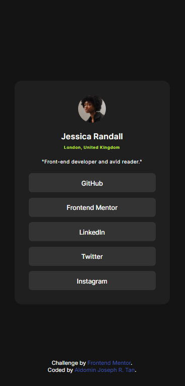

# Frontend Mentor - Social links profile solution

This is a solution to the [Social links profile challenge on Frontend Mentor](https://www.frontendmentor.io/challenges/social-links-profile-UG32l9m6dQ). Frontend Mentor challenges help you improve your coding skills by building realistic projects.

## Table of contents

- [Overview](#overview)
  - [The challenge](#the-challenge)
  - [Screenshot](#screenshot)
  - [Links](#links)
- [My process](#my-process)
  - [Built with](#built-with)
  - [What I learned](#what-i-learned)
  - [Useful resources](#useful-resources)
- [Author](#author)

**Note: Delete this note and update the table of contents based on what sections you keep.**

## Overview

### The challenge

Users should be able to:

- See hover and focus states for all interactive elements on the page

### Screenshot




### Links

- Solution URL: [https://github.com/AJ-Tan/3.-Frontend-Mentor---Social-Links-Profile.git]
- Live Site URL: [https://aj-tan.github.io/3.-Frontend-Mentor---Social-Links-Profile/]

## My process

### Built with

- Semantic HTML5 markup
- CSS custom properties
- CSS Grid

### What I learned

For this challenge, I focused on 2 things.

1. Improve naming conventions of classes of my HTML Tags.

- I focused on improving the implmentation of BEM for the naming conventions of my classes.

```html
<header class="profile-card__header">
  
  <section class="profile-card__user-details" aria-label="User Details">
    <h1 class="profile-card__name">Jessica Randall</h1>
    <p class="profile-card__location">London, United Kingdom</p>
  </section>
  <p class="profile-card__description">
    "Front-end developer and avid reader."
  </p>
</header>
```

2. Improve on how to be organized in writing css. I tried to write my css properties in a way that it is in alphabetical order. So far it looks good to me, but lets see if I can find a better way to do it later.

```css
.profile-card {
  background-color: var(--grey-800);
  border-radius: 1rem;
  container-type: inline-size;
  display: grid;
  gap: var(--spacing-md-1);
  justify-self: center;
  padding: var(--spacing-lg);
  width: clamp(15rem, 100%, 22rem);
}
```

### Useful resources

- [BEM Naming](https://getbem.com/naming) - This helped me to have a guideline on how I will name classes on my html tags

## Author

- GitHub - [AJ-Tan](https://github.com/AJ-Tan)
- Frontend Mentor - [@AJ-Tan](https://www.frontendmentor.io/profile/AJ-Tan)
